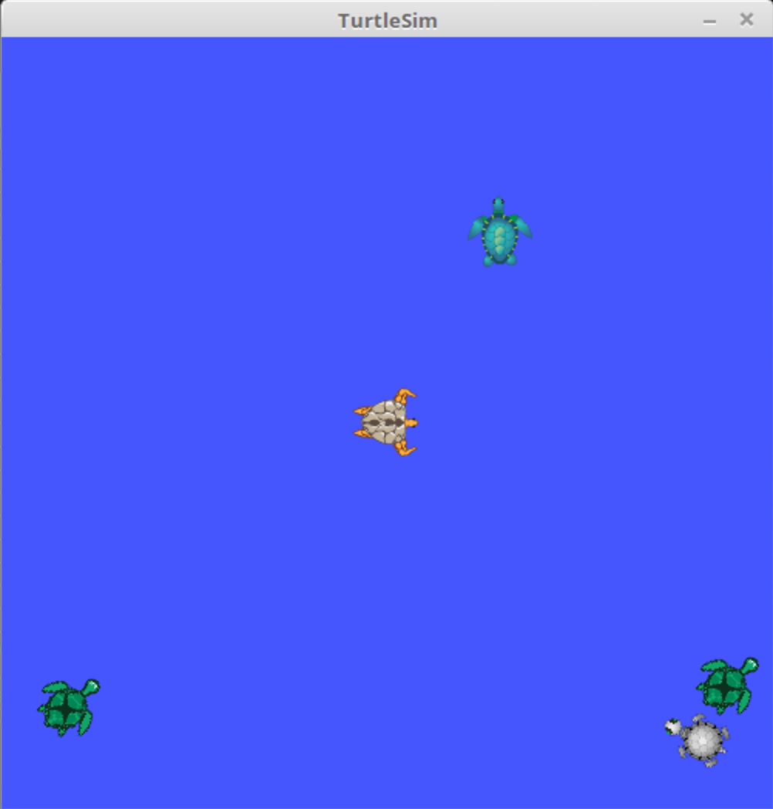
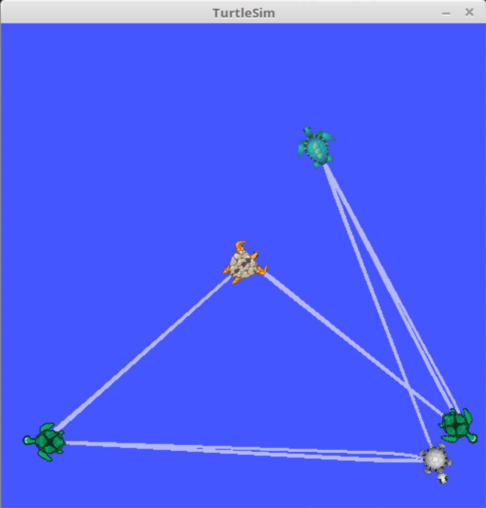

# __Exploration__

### _Author_: Livio Bisogni
###### __&copy; 2021 Turtley & Turtles Ltd.__
___
Let’s get to turtle each other!

## Prerequisites

* [ROS](http://wiki.ros.org/ROS/Installation) - An open-source, meta-operating system for your robots. Repository tested only under ROS Kinetic, though.

## How to compile
1. Move this folder (`exploration`) in `~/catkin_ws/src` (or wherever thy ROS workspace is).
2. Launch a terminal window and navigate to the aforementioned ROS workspace, e.g.,

	```
	$ cd ~/catkin_ws/
	```
3. Build the package:

	```
	$ catkin_make
	```

## How to execute
Open the terminal and type, e.g.,

```
$ roslaunch exploration move_turtle.launch
```

Launch another terminal window and type:

```
$ roslaunch exploration exploration.launch
``` 

## How to use

1. `NUM_TURTLES` turtles are given (initial positions defined in `move_turtle.launch`, line 8 and following; the integers `NUM_TURTLES` and `ROBOT_NUMBER`, defined in `exploration.cpp` and in `MoveTurtle.cpp`, respectively, should be adjusted accordingly).
2. Firstly, every turtle communicates its position.
3. Then, each one moves towards the position of the consecutive turtle.
4. Point 3 is repeated till each turtle has visited all other turtles' positions.
5. Finally, they go back to their initial positions.
6. Meanwhile, various types of information are printed on the terminal. Wait until the exploration node is shut down. Yet feel free to press `ESC` to exit the program anytime.




